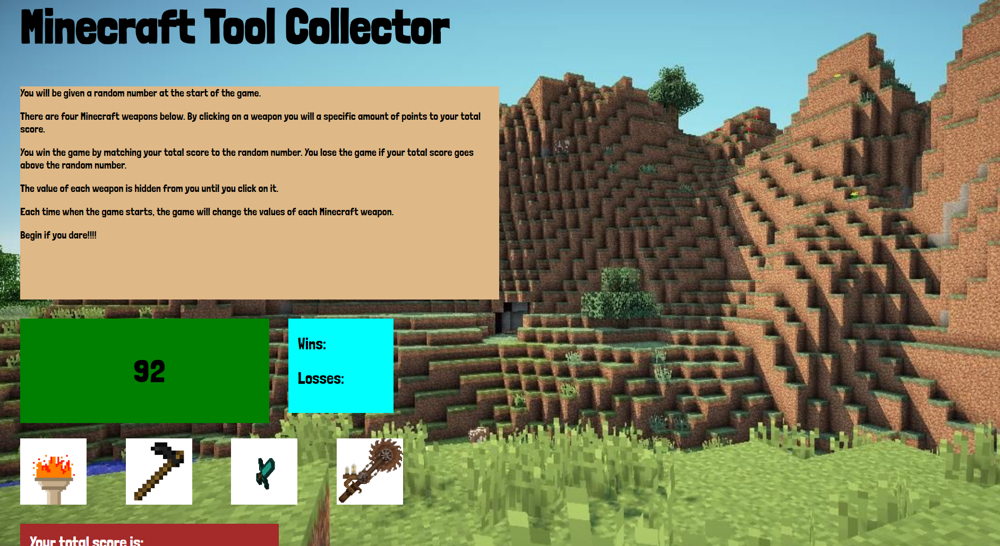

# Minecraft Tool Collector

A randomly generated number between 19 and 120 is used.  The user must select from the 
four minecraft tools.  Each tool has its own randomly generated number between 1
and 12.  The user must the select the tools and try to equal the master number.  If the
user score equals the master number, the Wins field will increment by one.  
If the user goes over the master number the Loss field increments by one.
